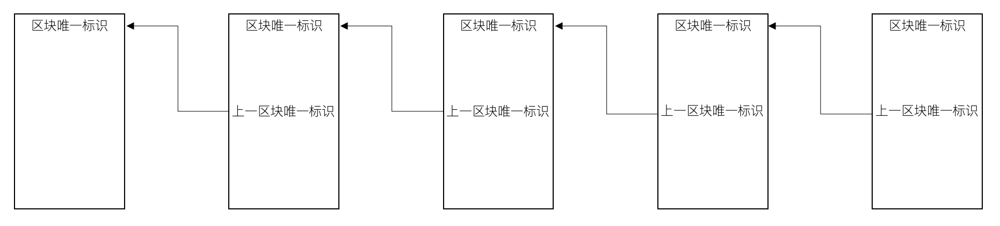

# 概述
本文讲述了区块链的基本技术原理，读者理解了区块链的基本技术原理，就可以更好的理解基于区块链技术的产品和方案。
# 比特币
说到区块链，就不得不提到比特币，区块链是一种技术，而这种技术源于比特币，是比特币率先采用了这个技术，并提出“区块链”的概念。

比特币最早起源于2008年11月，一位名叫中本聪的人，在网络上发表了一篇名为《一种点对点的电子现金系统》的论文，2009年1月，比特币网络上线（比特币网络就是指比特币软件，大家不要被“网络”这个词语迷惑了，之所以称为网络是因为每个安装了比特币软件的计算机，通过互联网连接在一起，并且比特币软件可以相互通信，就构成了一个网络系统）。中本聪希望构建一种不受任何政府、组织、个人把控的电子现金交易系统，如果要做到这一点，我们的资金交易就不能依赖银行的交易系统，可是如果没有了银行的交易系统，又如何保证交易的可靠性和安全性呢？中本聪的这篇论文提出了一种点对点的交易方案，所谓点对点，就是交易不经过中间交易系统，而是交易双方直接交易，并且可以保证交易的可靠性和安全性。
> 有兴趣的读者可以参考中本聪论文原文：[《一种点对点的电子现金系统》](https://bitcoin.org/files/bitcoin-paper/bitcoin_zh_cn.pdf)

中本聪的论文讲述了核心的概念和原理，但是读完之后，还是很难完全理解比特币这套电子现金交易系统是如何运作的。为了方便理解，我先讲比特币电子现金交易系统（后面就简称比特币系统）的整体运作流程，再对其中的概念展开讲解。

## 分布式账本
由于比特币系统要取消中间交易系统，实现点对点交易，同时又要保证系统的可靠性、数据不丢失，因此比特币系统设计了一个分布式的架构，即：每个安装了比特币软件，加入到比特币网络的计算机都会存储交易记录，从而保证交易数据不会丢失，这就是在很多比特币或者区块链相关资料中，都会提到的一个概念：“分布式账本”。我们可以把比特币系统理解成一个数据库系统，承载这个数据库的基础设施是全世界加入到比特币网络的计算机，数据库中保存的数据就是我们的每一笔交易数据，数据结构就是区块链。

区块链是由一个一个区块构成的有序链表，每一个区块都记录了一系列交易，并且每个区块都指向前一个区块，从而形成一个链条。如果我们观察某一个区块，就可以看到，每个区块都有一个唯一的哈希标识，被称为区块哈希，同时，区块通过记录上一个区块的哈希来指向上一个区块。

## 交易过程

# 区块链划代
1.0 2.0 3.0
